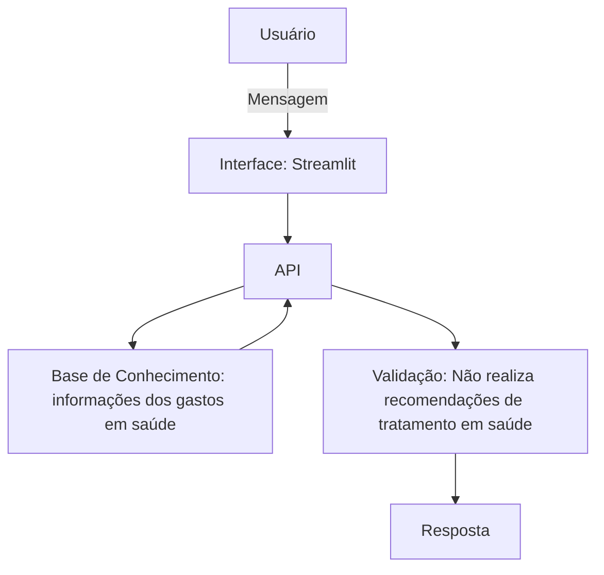

# Documentação do Agente

## Caso de Uso

Um agente financeiro inteligente que utiliza IA generativa para transformar dados de despesas relacionadas à saúde em previsões, recomendações e planejamento financeiro personalizado.

### Problema
> Qual problema financeiro seu agente resolve?

Muitas pessoas:

- Não sabem quanto gastam com saúde ao longo do ano.
- São surpreendidas por despesas inesperadas.
- Não possuem reserva financeira para tratamentos ou emergências.
- Têm dificuldade em visualizar para onde vai o dinheiro gasto com medicamentos, consultas e exames.

O HealthWallet AI funciona como um "planejador financeiro de saúde".

### Solução
> Como o agente resolve esse problema de forma proativa?

1. A Mari faz uma análise financeira, calculando o total gasto em saúde por mês, o percentual de rendad comprometida, quanto sobra para investimentos e reserva.
2. Com base no histório, a Mari pode realizar uma projeção futua, por exemplo quanto ao gasto anual previsto e a reserva ideal para emergências médicas.
3. Pode calcular um score da qualidade do planjamento financeiro da pessoa e mostrar pontos a melhorar.
4. Simula novos possíveis cenários de gastos em saúde, e sugere produtos em saúde compatíveis com o perfil do usuário.
5. Apresenta alertas inteligentes para que o usuário acompanhe os gastos em saúde.

### Público-Alvo
> Quem vai usar esse agente?

População geral que possui gastos em saúde fixos mensalmente.

---

## Persona e Tom de Voz

### Nome do Agente
Mari

### Personalidade
> Como o agente se comporta? (ex: consultivo, direto, educativo)

A Mari é educativa, conversa com o usuário de forma amigável e conselheira.

### Tom de Comunicação
> Formal, informal, técnico, acessível?

Acessível, usa linguagem de fácil compreensão.

### Exemplos de Linguagem
- Saudação: "Olá! Como posso ajudar a investir em sua saúde hoje?
- Confirmação: "Entendi! Deixa eu verificar quanto você já gastou com saúde esse mês."
- Sugestão: "Claro! Você pode começar a investir com um baixo custo considerando as seguintes opções: ..."
- Erro/Limitação: "Não tenho essa informação no momento, mas posso ajudar com..."

---

## Arquitetura

### Diagrama

### Componentes

| Componente | Descrição |
|------------|-----------|
| Interface | [Streamlit](https://streamlit.io/)|
| LLM | [ex: GPT-4 via API] |
| Base de Conhecimento | [ex: JSON/CSV com dados do cliente] |
| Validação | [ex: Checagem de alucinações] |

---

## Segurança e Anti-Alucinação

### Estratégias Adotadas

- [ ] [ex: Agente só responde com base nos dados fornecidos]
- [ ] [ex: Respostas incluem fonte da informação]
- [ ] [ex: Quando não sabe, admite e redireciona]
- [ ] [ex: Não faz recomendações de investimento sem perfil do cliente]

### Limitações Declaradas
> O que o agente NÃO faz?

A Mari não faz recomendações de tratamentos em saúde, como uso de medicamentos, fichas de treinamento esportivo ou dieta nutricional.
