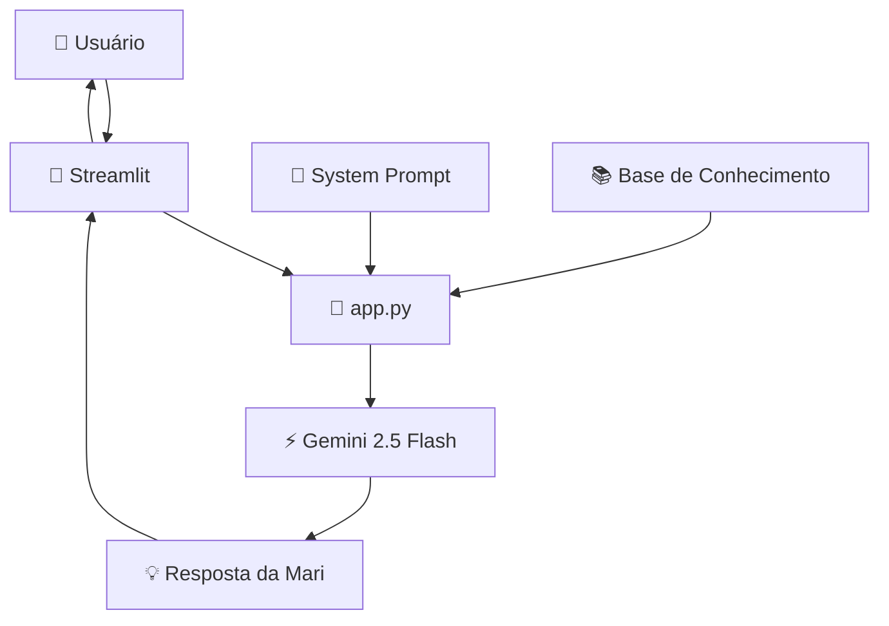

# Código da Aplicação

Esta pasta contém a implementação da **Mari**, uma agente de IA especializada em educação financeira aplicada à saúde.

A aplicação foi desenvolvida em Python utilizando Streamlit para a interface, Google Gemini 2.5 Flash para geração das respostas e arquivos locais como base de conhecimento.

---

# Estrutura do Código

```text
src/
└── app.py                 # Aplicação principal da Mari
```

---

# Principais Funcionalidades

A aplicação é responsável por:

- Carregar os dados do usuário presentes na pasta `data`;
- Construir um contexto personalizado utilizando perfil, transações e produtos em saúde;
- Aplicar regras de comportamento por meio do System Prompt;
- Enviar o contexto ao modelo Gemini 2.5 Flash;
- Exibir as respostas em uma interface de chat interativa desenvolvida com Streamlit;
- Tratar possíveis erros de comunicação com a API.

---

# Base de Conhecimento Utilizada

A Mari consulta exclusivamente os arquivos da pasta `data`:

```text
data/
├── perfil_usuario.json
├── transacoes.csv
└── produtos_saude.json
```

Esses arquivos permitem personalizar as respostas conforme:

- Perfil do usuário;
- Objetivos financeiros relacionados à saúde;
- Histórico de gastos;
- Produtos e serviços disponíveis.

---

# Tecnologias Utilizadas

| Tecnologia | Finalidade |
|------------|------------|
| Python | Desenvolvimento da aplicação |
| Streamlit | Interface do chatbot |
| Google Gemini 2.5 Flash | Modelo de IA Generativa |
| Pandas | Manipulação dos dados das transações |
| JSON | Armazenamento do perfil e produtos |
| CSV | Histórico financeiro |
| Python-dotenv | Gerenciamento da chave da API |

---

# Dependências

## requirements.txt

```txt
streamlit
google-genai
pandas
python-dotenv
```

---

# Fluxo da Aplicação



---

# Como Executar

## 1. Instalar as dependências

```bash
pip install -r requirements.txt
```

---

## 2. Configurar a chave da API

Criar um arquivo `.env` na pasta `src`:

```env
GOOGLE_API_KEY=sua_chave_aqui
```

---

## 3. Executar a aplicação

Na raiz do projeto:

```bash
streamlit run src/app.py
```

---

# Interface

A Mari possui uma interface conversacional simples e amigável construída com Streamlit.

O usuário pode fazer perguntas relacionadas a:

- Gastos em saúde;
- Planejamento financeiro;
- Produtos e serviços disponíveis;
- Investimentos em qualidade de vida;
- Hábitos financeiros e saúde.

---

# Segurança Implementada

A aplicação utiliza um System Prompt contendo regras explícitas para reduzir alucinações e aumentar a confiabilidade das respostas.

Entre elas:

- ✅ Responder apenas com base nos dados disponíveis;
- ✅ Não inventar custos ou serviços;
- ✅ Admitir limitações quando necessário;
- ✅ Não recomendar medicamentos;
- ✅ Não prescrever tratamentos específicos;
- ✅ Não indicar exercícios físicos individualizados;
- ✅ Incentivar sempre o acompanhamento por profissionais da saúde.

---

# Exemplo de Funcionamento

### Entrada do usuário

> "Quando vou conseguir investir em saúde mental se conseguir reduzir meus gastos atuais?"

### Processamento

1. A Mari consulta o perfil do usuário;
2. Analisa as transações registradas;
3. Considera os produtos e serviços disponíveis;
4. Monta um contexto personalizado;
5. Envia o contexto ao Gemini 2.5 Flash;
6. Gera uma resposta consultiva e preditiva.

### Saída

> A Mari apresenta projeções financeiras e diferentes cenários de investimento, permitindo que o usuário decida entre priorizar saúde física ou saúde mental no presente ou no futuro.

---

# Objetivo da Aplicação

A Mari foi projetada para atuar como uma educadora financeira em saúde, promovendo decisões mais conscientes e sustentáveis, sem substituir profissionais especializados.
